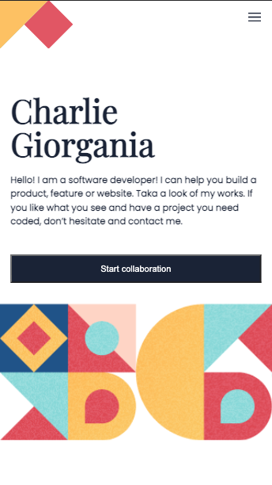

# Portfolio

> One paragraph statement about the project.



Additional description about the project and its features.

## Built With

- [HTML](https://developer.mozilla.org/en-US/docs/Web/HTML)
- [CSS](https://developer.mozilla.org/en-US/docs/Web/CSS)
- [Gulp](https://gulpjs.com/)
- [Stylelint](https://stylelint.io/)
- [Webhint](https://webhint.io/docs/user-guide/)

## Live Demo

[Live Demo Link](https://jorgevrgs.github.io/portfolio)

## Getting Started

To get a local copy up and running follow these simple example steps.

- Clone or download the repository
- Open the index.html in your browser

### Prerequisites

- [Node.js](https://nodejs.org/en/download/)

### Setup

Clone from the GitHub repository. Open your Terminal and run the command:

```
git clone git@github.com:jorgevrgs/portfolio.git
```

When the process is completed enter to the folder:

```
cd portfolio
```

As an alternative, to download the code, open the repository link [here](https://github.com/jorgevrgs/portfolio), and look for the green button `Code` and then click on the option `Download ZIP`.

### Install

```
npm install
```

### Usage

Linters:

```
npm run lint:css
npm run lint:css:fix
npm run lint:html
```

Build:

```
npm run build:css
npm run watch:css
```

### Run tests

```
npm test
```

### Deployment

GitHub Pages:

1. Open your repository page settings, i.e. `https://github.com/<USERNAME>/<REPOSITORY_NAME>/settings/pages` where USERNAME is your GitHub user, for instance `jorgevrgs`, and REPOSITORY_NAME is the name of the GitHub repository, for example `portfolio`.

1. Find the `Source` section and select the Branch, default is `main` and click on `Save` button.

1. As a result your page will be published at `https://<USERNAME>.github.io/<REPOSITORY_NAME>`.

## Authors

👤 **Jorge Vargas**

- GitHub: [@githubhandle](https://github.com/jorgevrgs)
- Twitter: [@twitterhandle](https://twitter.com/jorgevrgs1)
- LinkedIn: [LinkedIn](https://linkedin.com/in/jevargaslarrota)

## 🤝 Contributing

Contributions, issues, and feature requests are welcome!

Feel free to check the [issues page](../../issues/).

## Show your support

Give a ⭐️ if you like this project!

## Acknowledgments

- [Microverse](https://www.microverse.org/)
- My coding partners

## 📝 License

This project is [MIT](./MIT.md) licensed.
