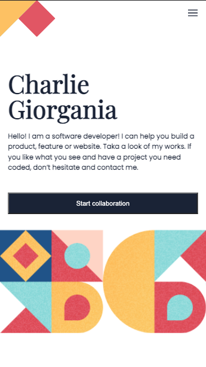

 [](https://github.com/jorgevrgs/portfolio/actions/workflows/linters.yml)

# Portfolio

> The portfolio is a project built with development best practices such as HTML semantic tags, CSS prefixes, Linters, accessibility and more.



## Built With

### Technologies

- [](https://developer.mozilla.org/en-US/docs/Web/HTML)
- [](https://developer.mozilla.org/en-US/docs/Web/CSS)
- [](https://developer.mozilla.org/en-US/docs/Web/JavaScript)

### Preprocessor

- [](https://sass-lang.com/)
- [](https://gulpjs.com/)
- [](https://babeljs.io/)

### Linters

- [](https://eslint.org/)
- [Stylelint](https://stylelint.io/)
- [Webhint](https://webhint.io/docs/user-guide/)

## Live Demo

[Live Demo Link](https://jorgevrgs.github.io/portfolio) 🔗

## Getting Started

To get a local copy up and running follow these simple example steps.

- Clone or download the repository
- Open the index.html in your browser

### Prerequisites

- [Node.js](https://nodejs.org/en/download/)

### Setup

Clone from the GitHub repository. Open your Terminal and run the command:

```
git clone git@github.com:jorgevrgs/portfolio.git
```

When the process is completed enter to the folder:

```
cd portfolio
```

As an alternative, to download the code, open the repository link [here](https://github.com/jorgevrgs/portfolio), and look for the green button `Code` and then click on the option `Download ZIP`.

### Install

```
npm install
```

### Usage

Linters:

```
npm run lint:css
npm run lint:css:fix
npm run lint:html
```

Build:

```
npm run build:css
npm run build:js
```

Watch:

```
npm run watch:css
npm run watch:js
```

Fix:

```
npm run lint:css:fix
npm run lint:js:fix
```

### Run tests

```
npm test
```

### Deployment

GitHub Pages:

1. Open your repository page settings, i.e. `https://github.com/<USERNAME>/<REPOSITORY_NAME>/settings/pages` where USERNAME is your GitHub user, for instance `jorgevrgs`, and REPOSITORY_NAME is the name of the GitHub repository, for example `portfolio`.

2. Find the `Source` section and select the Branch, default is `main` and click on `Save` button.

3. As a result your page will be published at `https://<USERNAME>.github.io/<REPOSITORY_NAME>`.

## Authors

👤 **Jorge Vargas**

- GitHub: [@jorgevrgs](https://github.com/jorgevrgs)
- Twitter: [@jorgevrgs1](https://twitter.com/jorgevrgs1)
- LinkedIn: [LinkedIn](https://linkedin.com/in/jevargaslarrota)

## 🤝 Contributing

Contributions, issues, and feature requests are welcome!

Feel free to check the [issues page](../../issues/).

## Show your support

Give a ⭐️ if you like this project!

## Acknowledgments

- [Microverse](https://www.microverse.org/)
- My coding partners

## 📝 License

This project is [MIT](./MIT.md) licensed.
